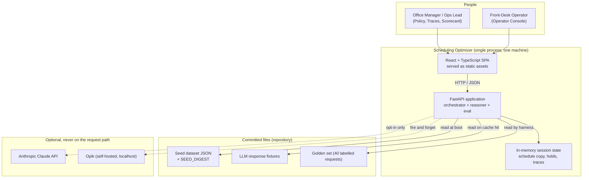
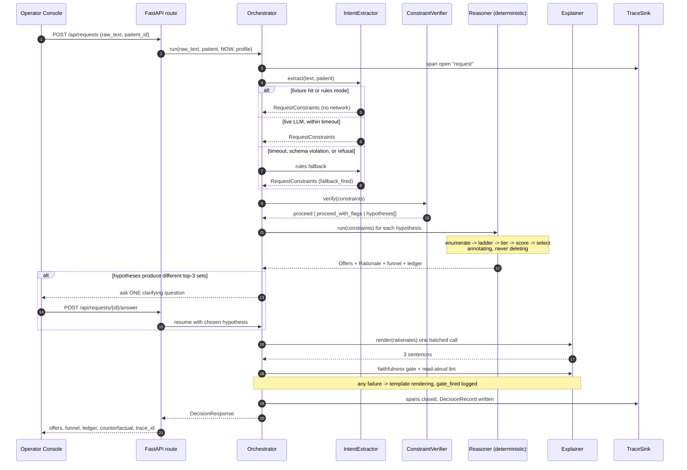
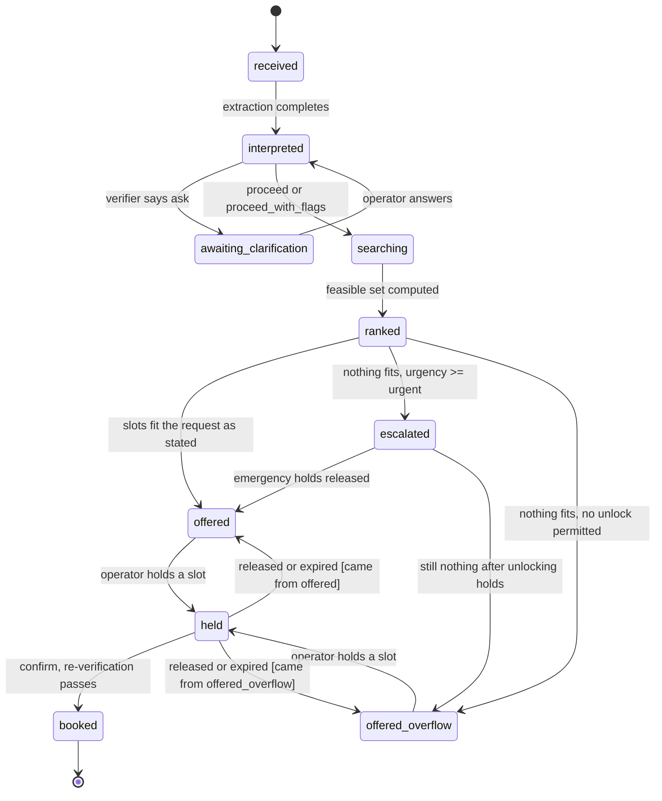
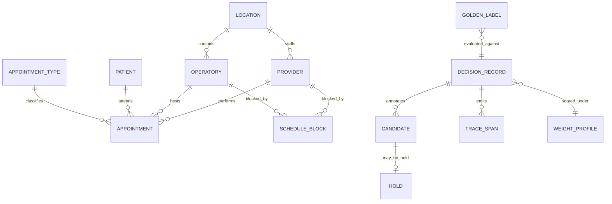
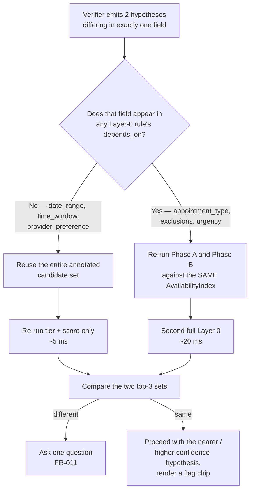
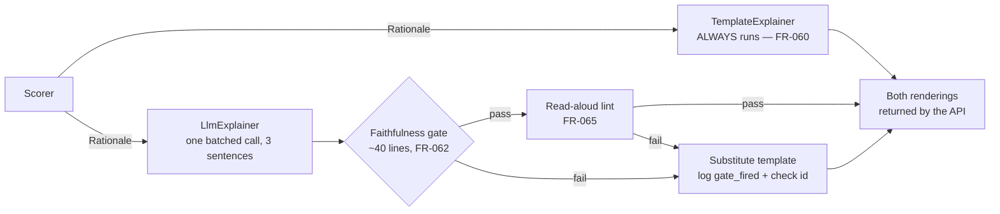
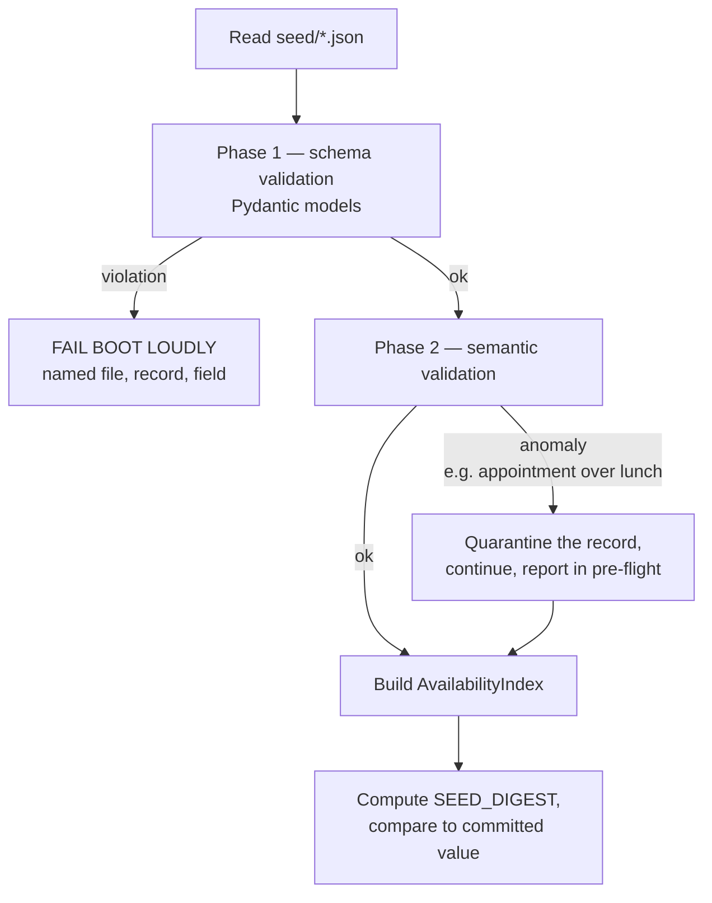
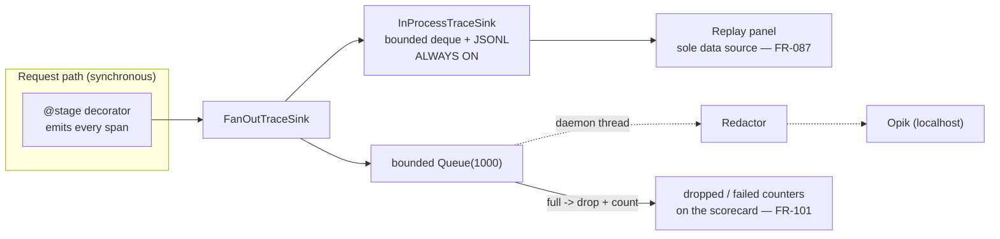

# Architecture — Intelligent Agentic Scheduling Optimizer

> **Status:** Proposed, awaiting review. **Upstream:** `docs/product-direction.md` (approved) →
> `docs/refined-prd.md` (approved 2026-08-08). **Downstream:** prototype (UI) and development plan.
>
> **What this document is.** It resolves the ten items the PRD handed to the architect (§15
> *Downstream Handoff Notes*), fixes the module boundaries, and specifies the data structures that
> the load-bearing requirements (SD-1, SD-2, SD-3) depend on. Requirement IDs (`FR-nnn`, `NFR-nn`)
> refer to `docs/refined-prd.md`.
>
> **Two labels are used for things this document adds:**
> **`[ADR-nn]`** — an architecture decision with a recorded rationale (§24).
> **`[AR-nn]`** — an *architecture refinement*: a place where implementation forced a correction or
> an addition to the PRD's stated spec. Every one is listed in §24 with what changed and why, so no
> deviation is silent. **Two of them (AR-01, AR-02) change requirements the PRD states as settled**
> and should be read before anything else.

---

## 1. What forces the shape of this system

Nine requirements drive nearly every structural decision. Everything else follows from them.

| # | Requirement | Structural consequence |
| - | :---------- | :--------------------- |
| 1 | **SD-1 — annotate, never delete** (FR-027) | There is no API to remove a candidate. `CandidateSet` is append-only at enumeration; every later stage writes annotations. The conservation invariant is asserted by the stage decorator, not by discipline. |
| 2 | **SD-2 — the scorer emits the `Rationale`** (FR-059) | The explainer package imports one module (`reasoner/rationale.py`) and cannot reach the schedule. Enforced by an import-guard test. |
| 3 | **SD-3 — injected clock, committed seed** (FR-102, FR-103) | One `Clock` provider, wired by dependency injection; an AST test fails the build on any other clock call. Seed data is loaded, validated, and never generated. |
| 4 | **Ranking is a pure function** (FR-054) | The LLM sits strictly upstream of `RequestConstraints` and strictly downstream of `Rationale`. Nothing in `reasoner/` imports `agents/`. |
| 5 | **Every agent is a `Protocol` with two implementations** (NFR-28) | Implementation choice is a config lookup in one registry. This is what makes FR-093's LLM-vs-rules number obtainable at all. |
| 6 | **Orchestrator under ~150 lines** (NFR-27) | The orchestrator owns sequencing, timeouts, fallback, and trace emission — nothing else. All domain logic lives in the packages it calls. |
| 7 | **No network, no container on the request path** (NFR-09, NFR-10) | `TraceSink` fans out; the Opik leg is a bounded queue drained by a worker thread. Fixtures are the default extraction source, not the fallback. |
| 8 | **< 2 s p95 offline, < 300 ms re-rank, < 500 ms stability** (NFR-01, NFR-04, NFR-05) | Axis evaluation is separated from weight application, so re-ranking is a matrix-by-vector product over values already computed. Availability lookups are O(1). |
| 9 | **Byte-identical output** (NFR-13) | No `set` iteration, no dict-order dependence, no floats in identity, no wall clock, no RNG without a fixed seed, canonical JSON serialisation everywhere. |

> **The one-sentence version of the architecture:** *language at the edges, arithmetic in the
> middle, and a single annotated candidate set that every stage writes to and no stage deletes
> from.*

---

## 2. System context



Two properties of this picture are requirements, not accidents:

- **The dotted edges can both be cut** and every MUST requirement still passes (NFR-09, NFR-10).
- **There is no database.** Committed JSON is the system of record; the session copy is memory
  (§6 non-goals). `git status` on the seed directory is clean after any number of bookings
  (FR-070).

The same diagram, plus the request-flow and reasoner-pipeline diagrams, are kept as standalone
`.mmd` files under `docs/diagrams/` for screen-share use — they are the source for the presentation
deliverable named in §13 of the PRD.

---

## 3. Runtime topology and process model

**One process. `make demo` starts `uvicorn`, which serves the API and the built SPA from the same
origin** `[ADR-14]`. No reverse proxy, no second port, no CORS configuration, no container.
Development uses `make dev`, which additionally runs Vite with a proxy — a developer convenience
that is not part of the demo path.

| Concern | Decision |
| :------ | :------- |
| Web framework | FastAPI on `uvicorn`, single worker, `asyncio` |
| Concurrency | One operator, one session (NFR-08). A module-level `SessionState` guarded by an `asyncio.Lock` for mutating routes |
| Background work | Exactly two daemon threads: the Opik queue drain (§14) and the eval-harness runner (§15). Neither can block a request |
| Static assets | `StaticFiles` mounted at `/`, API under `/api` |
| Python | 3.12 pinned via `uv` (`.python-version` + `uv.lock` committed) |
| Node | 25.x, Vite build output committed to `.gitignore`, built by `make demo` |

**Why one process:** every additional process is an additional way the demo fails on an unfamiliar
machine. The cost is that a frontend rebuild requires a backend restart, which matters during
development and not at all during a demonstration.

---

## 4. Module map

Package boundaries are load-bearing: three of them are asserted by import-guard tests, and the
dependency direction is what makes FR-054 and FR-059 structural rather than aspirational.

```
intelligent-agentic-scheduler-optimizer/
├── Makefile                        # demo | dev | test | eval | fit | check
├── pyproject.toml                  # uv, python 3.12
├── backend/
│   └── app/
│       ├── main.py                 # app factory, router mounting, static files
│       ├── config.py               # Settings (pydantic-settings); the ONLY place env is read
│       ├── container.py            # AppContainer: builds clock, stores, sinks, agent registry
│       ├── clock.py                # Clock protocol + FrozenClock  [SD-3]
│       │
│       ├── domain/                 # pure types; imports nothing from app.*
│       │   ├── entities.py         # Location, Provider, Operatory, AppointmentType, Patient,
│       │   │                       #   Appointment, ScheduleBlock, Hold
│       │   ├── request.py          # RequestConstraints, FieldValue, SourceSpan, Hypothesis
│       │   ├── candidate.py        # Candidate, Annotations, CandidateSet   [SD-1]
│       │   ├── rationale.py        # Rationale, Atom, FactSet               [SD-2]
│       │   ├── decision.py         # DecisionRecord, Offer, FunnelCounts
│       │   └── policy.py           # WeightProfile, EfficiencySubWeights
│       │
│       ├── data/
│       │   ├── repository.py       # ScheduleRepository Protocol            [NFR-29]
│       │   ├── memory_repo.py      # v1.0 implementation: in-memory session copy
│       │   ├── loader.py           # two-phase validation + quarantine report
│       │   ├── session.py          # SessionState: schedule copy, holds, per-key versions
│       │   ├── timezone.py         # THE conversion boundary                [NFR-32]
│       │   ├── digest.py           # canonical-JSON sha256 over the seed directory
│       │   └── seed/               # COMMITTED. *.json + SEED_DIGEST
│       │
│       ├── reasoner/               # deterministic core. Imports domain + data.repository ONLY.
│       │   ├── availability.py     # AvailabilityIndex, DoctorCheckIndex        [Q1]
│       │   ├── enumerate.py        # grid slots -> candidates
│       │   ├── ladder.py           # RULES: the fixed-order rule table as data  [FR-025]
│       │   ├── feasibility.py      # two-phase ladder execution
│       │   ├── tiers.py            # urgency gate, escalation, overflow
│       │   ├── scoring/
│       │   │   ├── time_fit.py  continuity.py  efficiency.py  prime_time.py
│       │   │   └── compose.py      # ScoreMatrix: axis values x weight vector   [ADR-06]
│       │   ├── rationale.py        # Rationale emission (by the scorer)         [SD-2]
│       │   ├── select.py           # tiebreak chain, epsilon-band, diversity
│       │   ├── counterfactual.py   # one-at-a-time relaxation
│       │   ├── hypotheses.py       # fan-out + shared-work reuse                [Q10]
│       │   └── baseline.py         # NaiveFirstAvailableReasoner (2nd impl)
│       │
│       ├── agents/                 # LLM boundary. Imports domain ONLY.
│       │   ├── protocols.py        # IntentExtractor, ConstraintVerifier, Explainer
│       │   ├── registry.py         # config -> implementation, in ONE place
│       │   ├── llm/
│       │   │   ├── client.py       # AsyncAnthropic wiring, per-stage timeouts
│       │   │   ├── prompts/        # versioned, committed .md prompt files
│       │   │   └── fixtures.py     # FixtureCache decorator (keyed, committed)
│       │   ├── extractor/          # llm.py | rules.py
│       │   ├── verifier/           # llm.py | rules.py
│       │   └── explainer/          # llm.py | template.py | gate.py | lint.py
│       │
│       ├── orchestrator/
│       │   ├── machine.py          # the state machine, <=150 lines            [NFR-27]
│       │   └── stages.py           # @stage decorator: span + invariant + timeout
│       │
│       ├── trace/
│       │   ├── sink.py             # TraceSink protocol + FanOutTraceSink       [Q6]
│       │   ├── inprocess.py        # bounded store, sole source for replay
│       │   ├── opik.py             # bounded queue + worker thread, best effort
│       │   └── redaction.py        # Redactor protocol: NoOp | Phi
│       │
│       ├── policy/                 # profiles, presets, rank stability
│       ├── eval/                   # harness, metrics, baseline, fit, sensitivity, report
│       │   └── golden/             # COMMITTED. golden_set.json + labels
│       └── api/                    # routers: requests, holds, policy, traces, eval, system
│
├── frontend/src/
│   ├── routes/       Console.tsx  Policy.tsx  Traces.tsx
│   ├── components/   InterpretationStrip  FunnelCounter  ContributionBar
│   │                 StabilityIndicator  OfferCard  RejectionLedger  ManualGrid
│   ├── lib/          api.ts (generated types)  hotkeys.ts  format.ts
│   └── store/        session.ts (zustand: presentation mode, active request)
│
├── scripts/generate_seed.py        # offline, seeded, NOT invoked by boot      [FR-103]
├── tests/                          # see §22
└── docs/  architecture.md  refined-prd.md  product-direction.md  diagrams/
```

**Enforced dependency rules** (each an import-guard test in `tests/structure/`):

| Rule | Requirement |
| :--- | :---------- |
| `reasoner/**` must not import `agents/**` | FR-054 — ranking is independent of the LLM |
| `reasoner/**` must not import any concrete store — only `data.repository` | NFR-29 — persistence is swappable without touching domain logic |
| `agents/explainer/**` must not import `reasoner/**` except `reasoner.rationale` | FR-059 |
| `agents/verifier/**` must not import `data/**` or `reasoner/**` | FR-009 — the verifier is schedule-blind |
| No module outside `trace/` may import the Opik SDK | FR-085 |
| No module outside `clock.py` may call `datetime.now`, `date.today`, `time.time` | FR-102 |
| No naive `datetime` may be constructed outside `data/timezone.py` | NFR-32 — one conversion boundary |

---

## 5. Request lifecycle

### 5.1 End-to-end flow



### 5.2 Orchestrator state machine

Mirrors the PRD's request-lifecycle table (§7 UC-05) exactly; it is the shape of `machine.py`.



The two exits from `held` carry **guards** — `[came from …]` — because there is one `held` state and
the return target depends on `DecisionRecord.origin_state`, not on anything the hold itself knows.
That is the whole content of `[AR-09]`: the origin has to be stored, or an expired hold on an
alternative option comes back looking like a normal offer.

### 5.3 The orchestrator itself

`machine.py` is a flat `async def run(...)` with one block per stage. It contains no domain logic —
its entire job is sequencing, the timeout/fallback ladder (NFR-03), and a `TraceSink` emit per hop.
This is the shape it must keep to stay under 150 lines and readable in five minutes (NFR-27):

```python
async def run(self, req: IncomingRequest) -> DecisionRecord:
    now = self.clock.now()
    with self.sink.span("request", request_id=req.id) as root:

        # 1. INTERPRET -------------------------------------------------------
        constraints = await self.stage(
            "extract",
            primary=lambda: self.agents.extractor.extract(req.text, req.patient, now),
            fallback=lambda: self.agents.rules_extractor.extract(req.text, req.patient, now),
            timeout=self.settings.timeout_extract,
        )

        # 2. VERIFY ----------------------------------------------------------
        verdict = await self.stage(
            "verify",
            primary=lambda: self.agents.verifier.verify(constraints, self.world),
            fallback=lambda: self.agents.rules_verifier.verify(constraints, self.world),
            timeout=self.settings.timeout_verify,
        )

        # 3. REASON (deterministic; once per hypothesis, sharing Layer 0) -----
        outcomes = self.hypotheses.run(constraints, verdict.hypotheses, self.session, now)

        # 4. DECIDE: ask at most one question, only if it changes the answer --
        if outcomes.top3_sets_differ():                       # FR-011
            return self.record(root, state="awaiting_clarification", ask=outcomes.question())
        outcome = outcomes.resolved()

        # 5. EXPLAIN (never touches the schedule) -----------------------------
        outcome.offers = await self.stage(
            "explain",
            primary=lambda: self.agents.explainer.render(outcome.rationales),
            fallback=lambda: self.agents.template_explainer.render(outcome.rationales),
            timeout=self.settings.timeout_explain,
            gate=self.gate,                                    # FR-062, per-sentence
        )

        # 6. RECORD ----------------------------------------------------------
        return self.record(root, state="offered", outcome=outcome)
```

`self.stage(...)` is the single place where a timeout, a fallback, and a span exist. Every
per-stage timeout, every `fallback_fired`, and every `gate_fired` in the system passes through
those ~25 lines in `stages.py` — which is why "what happens when the LLM is slow?" has one answer
and one place to read it.

---

## 6. Agent seams

Three LLM-capable roles, each a `Protocol` with two implementations, selected by config in one
registry `[ADR-03]`. The fourth role in the topology — the Schedule Reasoner — is deliberately not
LLM-capable, and its "second implementation" is the naive first-available baseline the eval harness
needs anyway (FR-095). That is a genuine second implementation of the same protocol, not a stub:

```python
class ScheduleReasoner(Protocol):
    def run(self, c: RequestConstraints, s: SessionState, now: datetime) -> ReasonerOutcome: ...

# reasoner/pipeline.py   -> DeterministicReasoner   (the product)
# reasoner/baseline.py   -> NaiveFirstAvailableReasoner (the control, FR-095)
```

| Role | Protocol | Implementation A | Implementation B | Selected by |
| :--- | :------- | :--------------- | :--------------- | :---------- |
| Intent Extractor | `IntentExtractor` | `LlmIntentExtractor` | `RuleIntentExtractor` | `settings.extractor` |
| Constraint Verifier | `ConstraintVerifier` | `LlmConstraintVerifier` | `RuleConstraintVerifier` | `settings.verifier` |
| Explainer | `Explainer` | `LlmExplainer` (gated) | `TemplateExplainer` | `settings.explainer` |
| Schedule Reasoner | `ScheduleReasoner` | `DeterministicReasoner` | `NaiveFirstAvailableReasoner` | `settings.reasoner` |

**Fixtures are a decorator, not a third implementation** `[ADR-04]`. `FixtureCache(inner, store)`
implements the same protocol and wraps the LLM one:

```python
extractor = FixtureCache(LlmIntentExtractor(client), store)      # offline default
```

Cache key = `sha256(stage | prompt_version | model_id | canonical(request_text, patient_ref))`
(FR-006). This keeps "which implementation ran?" a two-value question rather than three, and it
means the fixture path and the live path are byte-identical in everything except where the JSON
came from.

**Why this seam is worth its cost:** it is the only reason FR-093 can print two columns of
extraction accuracy. Without it, "we used an LLM here" is a preference; with it, it is a number.

---

## 7. Domain model



Three types carry most of the design weight, and each has a shape decision attached.

### 7.1 `Candidate` and `CandidateSet` — SD-1 made structural

Identity is frozen; annotation is mutable and additive. There is deliberately **no `remove`,
`filter`, or `__delitem__`** on `CandidateSet` — a stage cannot delete a candidate because the type
does not offer the operation.

```python
@dataclass(frozen=True, slots=True)
class Candidate:                       # identity — never changes after enumeration
    candidate_id: str                  # deterministic: sha1 of the tuple below  (FR-017)
    start: datetime
    duration_min: int
    provider_id: str
    operatory_id: str

@dataclass(slots=True)
class Annotations:                     # written by stages, never cleared
    feasible: bool | None = None
    rejection_reason: str | None = None      # exactly one, first rule failed  (FR-028)
    tier: str | None = None
    axes: AxisValues | None = None
    score: float | None = None
    rank: int | None = None
    rationale: Rationale | None = None

class CandidateSet:
    def add(self, c: Candidate) -> None: ...          # enumeration only
    def annotate(self, cid: str, **kw) -> None: ...
    def view(self, **predicate) -> Iterator[...]: ...  # read-only projections
    def conserve(self) -> None:                        # FR-027 invariant
        assert self.n_feasible + sum(self.rejected_by_reason.values()) == len(self)
```

`conserve()` runs after every stage, from the `@stage` decorator — in every mode, not only under
test. The funnel counter (FR-029) reads these same counts, which is what makes the four numbers on
screen trustworthy rather than decorative.

### 7.2 `Rationale` — SD-2 made structural

Emitted **by the scorer**, in `reasoner/rationale.py`. The explainer receives this object and
nothing else:

```python
@dataclass(frozen=True, slots=True)
class Atom:
    axis: str            # "time_fit" | "continuity" | "efficiency" | "prime_time"
    value: float
    weighted: float
    text: str            # human-readable, produced by the axis scorer itself

@dataclass(frozen=True, slots=True)
class FactSet:           # the ONLY entities an explanation may name  (FR-062)
    provider_name: str;  weekday: str;      date_display: str
    start_display: str;  end_display: str;  operatory_name: str
    duration_min: int;   type_name: str;    patient_first_name: str

@dataclass(frozen=True, slots=True)
class Rationale:
    facts: FactSet
    components: tuple[Atom, ...]     # top 2-3 weighted contributions, descending
    caveat: Atom | None              # at most one  (FR-066)
```

Each axis scorer returns `(value, atom_text, subterms)` — the human-readable atom is produced where
the number is produced. That is the mechanism by which an explanation cannot describe a component
that did not contribute: the text and the value have a single origin.

### 7.3 `WeightProfile` — policy as data

```python
@dataclass(frozen=True, slots=True)
class WeightProfile:
    id: str; name: str; is_fitted: bool; fit_objective_value: float | None
    scope: Scope                       # platform | group | location      [NFR-30]
    scope_ref: str                     # the owning id at that level
    weights: Weights                   # time_fit, continuity, efficiency, prime_time; sum == 1.0
    efficiency_subweights: SubWeights   # 0.40 / 0.25 / 0.20 / 0.15  [A-12]

    def effective_for(self, t: AppointmentType) -> Weights:
        """Apply the type's continuity multiplier and renormalise.  [A-11], Q7."""
```

`Σ weights == 1.0 ± 1e-9` is validated on construction and on every tuner change (FR-039). A grep
test asserts no numeric weight literal appears inside `reasoner/scoring/` (FR-046).

`scope` / `scope_ref` are carried from v1.0 with every profile at `location` scope on the single
seeded location. **The resolution logic — platform default overridden by group policy overridden by
location — is deferred; the field is not** `[NFR-30]`. A nullable column costs nothing today, and
retrofitting an owner onto a table that already has rows costs a migration plus a backfill of
guesses about who owned what. It is also the point at which the multi-practice product becomes real:
central policy with governed local override is the thing being sold at scale, and it cannot be
expressed without an owner.

### 7.4 PHI marking — the redactor is derived, not written `[NFR-31]`

Fields that would carry PHI in production are annotated on the domain type, and
`trace/redaction.py` builds its field set by **reflecting over those annotations**:

```python
@dataclass(frozen=True, slots=True)
class DecisionRecord:
    raw_text: Annotated[str, PHI]                    # the request text IS PHI once a
    constraints: Annotated[RequestConstraints, PHI]  #   patient describes a symptom
    origin_state: OfferState                         # offered | offered_overflow   [AR-09]
    scope: Scope; scope_ref: str                     # [NFR-30]
    ...
```

The alternative — a hand-maintained list of field names inside the redactor — is correct exactly
once and then silently wrong the first time someone adds a field without knowing the list exists.
A test adds a new PHI-marked field and asserts the redactor covers it **with no change to the
redactor**; that test is the requirement.

In v1.0 the data is synthetic and the active redactor is a no-op, so this buys nothing today. It
is here because it costs a decorator now and an audit later.

---

## 8. The reasoner

### 8.1 Availability: minute-resolution occupancy with prefix sums `[Q1] [ADR-05]`

This is the answer to *"the free-interval representation that makes containment cheap."* Rather
than sorted interval lists with merge logic, each `(resource, business_day)` gets a
**minute-resolution occupancy bitmap and its prefix sum**:

```python
busy[r][d][m]        = 1 if resource r is occupied at minute-offset m on day d
prefix[r][d][m]      = sum(busy[r][d][:m])

def is_free(r, d, start_m, end_m) -> bool:            # O(1)
    return prefix[r][d][end_m] - prefix[r][d][start_m] == 0
```

Occupancy is the union of appointments, `ScheduleBlock`s in scope, PTO, and off-location days.
Sizing: 15 resources (6 operatories + 9 providers) × 20 business days × ≤ 541 entries ≈ 162 000
integers — trivially in memory (NFR-07).

**Why this and not interval trees:** every feasibility question in the ladder is *"is this exact
window entirely free?"*, which a prefix sum answers in one subtraction and an interval structure
answers with a search plus a loop. It is faster, and — more importantly for NFR-27 — it is four
lines that a reviewer can verify by inspection.

**Invalidation is per `(resource, day)`, not global** `[ADR-16]`. The index is a pure function of
`(schedule, mutations)` and is memoised — but the memo key is the **individual `(resource, day)`
cell**, each carrying its own version, rather than one counter for the whole index. Booking Dr.
Patel into OP-3 on the 12th invalidates exactly one cell and rebuilds ~541 entries; every other
cell is untouched.

The global-counter version would work fine at one location and is wrong the moment there are two:
a write anywhere would rebuild everything everywhere, turning an O(1) invalidation into O(all
resources × all days) **per write**. Since the structure is already keyed that way, this is a
dictionary-key change rather than a redesign — which is precisely why it is worth doing now rather
than after code depends on the coarse version. The PRD's R-05 already names *"a precomputed
availability index with incremental invalidation"* as the production shape; this is the granularity
that makes that sentence true.

The same key structure gives the production requirement for free: **external** changes (a
cancellation in the practice-management system, a provider calling in sick) invalidate the same
cells by the same mechanism. The index does not care whether a change originated with us.

Holds are deliberately *not* in the index `[AR-03]`: there are at most a handful, they change
often, and rebuilding cells to add three intervals would put latency on the offer path for nothing.
They are checked as a small overlay list inside the ladder instead.

**Doctor-check index.** Derived from the dentist bitmaps once per version:

```
C[d][m]      = 1 if SOME credentialed dentist is free for all of [m, m+10)
prefixC[d][m]= running count of C
```

A containment query is then one subtraction (§8.4). Naming *which* dentist is deferred to the few
candidates that are actually offered, where the rationale needs it.

### 8.2 Enumeration and the two-phase ladder `[AR-04]`

FR-016's arithmetic acceptance criterion is expressed over `business_minutes / 10 × operatories` —
a **grid-slot** count with no provider dimension — while FR-017 defines candidate identity as
`(start, duration, provider, operatory)`. The architecture reconciles these by reporting both
numbers:

| Number | Definition | Reference dataset | Used by |
| :----- | :--------- | :---------------- | :------ |
| `grid_slots` | `(business minutes in horizon ÷ 10) × operatories` | 5 580 ÷ 10 × 6 = **3 348** | FR-016's arithmetic test |
| `enumerated` | `grid_slots × eligible providers for the type` | prophy: × 4 hygienists = **13 392** | The funnel counter and the FR-027 conservation invariant |

Both appear in the trace and in the API response. The conservation invariant is stated over
`enumerated`, because that is the set that carries rejection reasons.

Execution is **two-phase**, which is both the performance story and the fan-out story:

```
Phase A — slot-level rules, evaluated once per grid slot (provider-independent)
  1. within_business_hours        -> BEFORE_OPEN | PAST_CLOSE
  2. not_overlapping_global_block -> BLOCKED_LUNCH | BLOCKED_HUDDLE | BLOCKED_ADMIN
  3. emergency_hold_locked        -> EMERGENCY_HOLD_LOCKED
  4. patient_exclusion            -> PATIENT_EXCLUSION
  5. operatory_free(d + turnover) -> OPERATORY_BUSY | OPERATORY_TURNOVER
 5b. slot_not_held_by_other       -> SLOT_HELD              [AR-03]
  6. operatory_equipped(type)     -> OPERATORY_NOT_EQUIPPED

Phase B — provider-level rules, per (surviving slot x eligible provider)
  7. provider_free(d)             -> PROVIDER_BUSY | PROVIDER_PTO
  8. provider_credentialed(type)  -> PROVIDER_NOT_CREDENTIALED
  9. provider_at_location(day)    -> PROVIDER_OFFSITE
 10. doctor_check_containment     -> DOCTOR_CHECK_UNAVAILABLE
 -> feasible
```

A Phase-A rejection is written to *every* candidate in that slot with the same cause, which
preserves both the fixed order of FR-025 and the single-cause guarantee of FR-028 while doing the
work once. The rule order lives in **one table** (`ladder.py::RULES`) with each rule carrying its
code, its predicate, its phase, and its `depends_on` set — reordering the table is the only way to
change ledger causes, and a snapshot test covers it (FR-025).

Measured shape on the reference dataset: ~3 348 Phase-A evaluations, of which roughly a quarter to
a third survive to Phase B, giving ~3–4 000 provider-level checks. Every check is O(1). This is the
evidence behind *"the LLM call is the latency floor, not the search"* (NFR-06, R-05).

### 8.3 Rule dependency declaration — the key to cheap fan-out

Each rule declares which `RequestConstraints` fields it reads:

| Rule | `depends_on` |
| :--- | :----------- |
| 1, 2, 5, 5b | ∅ (schedule and calendar only) |
| 3 `emergency_hold_locked` | `urgency` |
| 4 `patient_exclusion` | `exclusions` |
| 6, 7, 8, 9, 10 | `appointment_type` (duration, equipment, credential, doctor-check) |

Consequence, used directly in §9: **`date_range`, `time_window`, and `provider_preference` are not
Layer-0 inputs at all.** They influence tier assignment and scoring, never feasibility.

### 8.4 Doctor-check containment `[Q1]` — the requirement most likely to be built wrong

Semantics (FR-023): candidate `[s, s+d)` is feasible only if some credentialed dentist `p` and time
`t` satisfy `[t, t+10) ⊆ [s + ⌈2d/3⌉, s+d)` **and** `[t, t+10) ⊆ free(p)`.

```python
def doctor_check_ok(day, s_m: int, d: int) -> bool:
    a = s_m + ceil(2 * d / 3)      # start of the last third
    b = s_m + d                    # end of the appointment
    if b - a < CHECK_MIN:          # window narrower than the check -> impossible
        return False
    return prefixC[day][b - CHECK_MIN + 1] - prefixC[day][a] > 0
```

Read that as: *is there any minute in the last third at which a dentist has ten uninterrupted
minutes, with all ten still inside the appointment?* The `b - CHECK_MIN + 1` upper bound is what
makes it containment rather than overlap — a check starting later than `b - 10` would extend past
the appointment's end and is not counted.

This shape makes FR-023's specified failures structural rather than incidental:

| Test | Outcome | Why |
| :--- | :------ | :-- |
| Dentist free only in the first third | rejected | The query range starts at `a`; earlier minutes are never inspected |
| 9 contiguous free minutes inside the last third | rejected | `C[m]` requires all 10 of `[m, m+10)` |
| Exactly 10 minutes ending at `s+d` | feasible | Upper bound is inclusive of `b - 10` |
| 10 minutes straddling the boundary (5 before, 5 inside) | rejected | Its start is `< a`, outside the query range |
| An overlap implementation | fails tests 1 and 4 | `test_doctor_check_is_containment_not_overlap` asserts this |

### 8.5 Urgency gate

A gate, not a weight (FR-032). Tier assignment is a pure function of `(candidate.start, NOW,
constraints)`; ranking runs over the highest non-empty tier only. Because tiering happens *before*
any weight is applied, the property test over 200 random weight vectors is satisfied by
construction — no weight vector is ever consulted when comparing across tiers.

Escalation ladder when the top tier is empty (FR-035, FR-036, FR-038):

```
top tier empty
  └─ urgency >= urgent ? unlock emergency_hold blocks, re-run Phase A on those slots only
        └─ still empty ? nearest candidates outside window/tier, labelled overflow
              └─ still empty ? nearest three beyond the horizon, labelled
```

The response is guaranteed non-empty (`len(offers) + len(overflow) >= 1`) by an assertion at the
end of the stage, not by inspection of the seed data.

### 8.6 Scoring: an axis matrix times a weight vector `[ADR-06]`

The single most consequential performance decision in the system. **Axis values do not depend on
the weights.** So the scorer computes, once per request:

```
A ∈ R^(n x 4)   # rows = in-tier candidates, columns = the four axis values in [0,1]
```

and every downstream question is a product against that fixed matrix:

| Question | Computation | Requirement | Budget |
| :------- | :---------- | :---------- | :----- |
| Score under the active profile | `A @ w_eff` | FR-039 | — |
| Re-rank on a tuner change | `A @ w_eff'` — **no re-scoring** | FR-079, NFR-04 | < 300 ms |
| Rank stability, 200 seeded vectors | `A @ W_effᵀ`, 200 columns | FR-081, NFR-05 | < 500 ms |
| Sensitivity sweep, 21 × 4 vectors | same | FR-099 | harness |
| Weight fitting over the simplex | same, ~1 771 vectors × 40 requests | FR-098 | < 60 s |

The efficiency axis is itself a fixed-sub-weight composite (FR-042, `[A-12]`), so it collapses to a
single column; the tuner exposes four axes, and the four sub-terms remain separately inspectable in
the trace.

`A` is cached on the session's `DecisionRecord`, which is what makes the re-rank path a lookup plus
a dot product rather than a second pipeline run.

**Numerics.** The request path is pure Python — 200 samples × ~300 candidates × 4 axes is ~240 k
multiplications, comfortably inside NFR-05, and stays readable. **`numpy` is an eval-harness-only
dependency** `[AR-07]`, where fitting is ~85 M operations and pure Python would miss FR-098's
60-second bound. The request path must never import it, which keeps the demo's dependency surface
minimal and the scoring code inspectable.

### 8.7 Continuity: multiplier with renormalisation, not a hard constraint `[Q7] [ADR-07]`

The PRD flagged a choice: keep `[A-11]`'s per-type continuity multiplier, or promote
high-criticality continuity (crown seat) to a Layer-0 hard constraint. **Decision: keep the
multiplier.**

Rationale, recorded because the PRD asked for it explicitly:

1. **Promoting it would produce empty results in exactly the case a human handles easily.** If the
   dentist who did the prep is on PTO, a hard constraint returns overflow or nothing. A practice
   books a different dentist and tells the patient. The multiplier ranks same-dentist first while
   leaving the alternative offerable.
2. **It would damage the rejection ledger's credibility.** The ledger's claim is *"this was
   impossible."* Filling it with candidates that are merely undesirable weakens the one surface
   that makes the system's thoroughness legible.
3. **FR-041's acceptance criterion is satisfiable without it.** With a 2.0 multiplier on crown
   seat, same-dentist candidates rank above every different-dentist candidate in the same tier —
   which is what the AC asserts.

**Its visible consequence, which must be built:** when a multiplier is active, the effective weight
vector differs from the one shown on the policy panel. The API therefore returns **both** the
nominal profile and the effective vector, and the contribution bar renders the effective one with
the multiplier named. Without this the card and the panel would appear to contradict each other,
and the tuner's credibility is the thing the panel exists to establish.

`provider_preference` enters here `[AR-05]`: when the request states one, the continuity axis
measures affinity to the *stated* provider rather than to the patient's assigned provider. This is
what makes "drop the provider preference" a meaningful counterfactual (FR-055) rather than a no-op.

### 8.8 Selection: deterministic, co-equal, diverse

```
sort by score desc, tiebreak chain (FR-048): start -> continuity -> frag delta -> operatory id
  -> group into epsilon-bands of 0.03  (FR-049)
     -> greedy select, skipping same-provider + same-day + within-60-min  (FR-050)
        -> if fewer than 3 selected, relax suppression and record limited_availability
```

Every comparison is over integers, strings, or floats rounded to a fixed precision, and every list
is materialised in a deterministic order. Ties are impossible to resolve non-deterministically
because the chain terminates in `operatory_id`, which is unique per candidate within a slot.

### 8.9 Counterfactual

Four trials, one relaxed constraint each (FR-055). Because none of the relaxations touch a Layer-0
dependency (§8.3), **all four reuse the same feasible set and the same axis matrix**, recomputing
only the affected column:

| Trial | Recomputed |
| :---- | :--------- |
| window ± 60 min, ± 120 min | `time_fit` column |
| provider preference dropped | `continuity` column |
| urgency window extended one tier | tier assignment only |

Total cost is a few milliseconds. Hard constraints and patient exclusions are never relaxed — the
relaxation set is a closed enumeration in code, so FR-057's safety property is enforced by there
being no code path that could relax anything else.

---

## 9. Hypothesis fan-out and shared work `[Q10]` — the STRETCH feature, kept

The PRD asks whether running the deterministic pipeline twice per request fits inside NFR-01, or
whether a shared-work optimisation is needed. **It fits, and the optimisation is nearly free
because §8.3 already declares which rules depend on which fields.**



The two ambiguity classes in scope behave differently, and both are affordable:

| Class | Differing field | Layer 0 shared? | Added cost |
| :---- | :-------------- | :-------------- | :--------- |
| **Relative date** — "next Thursday" (edge case 11) | `date_range` | **Yes, entirely** | ~5 ms — tier and score only |
| **Appointment type** — limited exam vs. crown (edge case 6a) | `appointment_type` | No — duration, equipment, credentials and doctor-check all change | ~20 ms — a second enumeration pass over a shared index |

The expensive artefact, the `AvailabilityIndex`, is built once per schedule version and shared by
every hypothesis regardless. The worst case — type fan-out, two hypotheses — adds roughly 20 ms to
a ~170 ms offline budget (§19). **No further optimisation is warranted, and the fan-out stays as
the PRD specifies it,** capped at 2 hypotheses per field and 1 field per request (FR-012, FR-014),
with the flag visible in config.

---

## 10. Explanation, gate, and lint



**One batched LLM call produces all three sentences** `[ADR-09]`, returning a JSON array. Three
sequential calls would triple the tail latency on the most visible surface; three parallel calls
would triple the failure surface for no quality gain. The gate and the lint run **per sentence**,
so one bad sentence falls back to its own template without disturbing the other two.

The gate's five checks (FR-062) run against `Rationale.facts` and `Rationale.components` only —
it never sees the schedule, which is why it is ~40 lines and independently unit-testable without
any fixture.

The **read-aloud lint** is a shared module used by three callers: the gate, the eval harness, and
CI. Its banned-token list is committed as data (`explainer/banned_tokens.json`), so extending it is
a data change and CI enforces it over every golden-set output in both modes (FR-065).

---

## 11. Clock and data loading `[Q4]`

### 11.1 Clock

```python
class Clock(Protocol):
    def now(self) -> datetime: ...

@dataclass(frozen=True)
class FrozenClock:
    reference: datetime          # 2026-08-10T09:00:00-07:00  [D-01]
    def now(self) -> datetime: return self.reference
```

Injected through `AppContainer`, reached by routes as a FastAPI dependency. An AST test walks
`backend/app/**` and fails the build on `datetime.now`, `datetime.utcnow`, `datetime.today`,
`date.today`, or `time.time` outside `clock.py` (FR-102, NFR-14). A separate test runs the full
golden set with the machine clock set months forward and asserts identical output — run, not
assumed.

### 11.2 The timezone boundary `[NFR-32] [ADR-17]`

v1.0 has one timezone, `America/Los_Angeles`, and no DST boundary inside the seed window `[A-18]`.
That assumption is **confined to one module** rather than diffused through the code, because it is
the assumption most certain to break and the one whose breakage is least visible.

```
  Storage / API boundary          data/timezone.py            Reasoner
  ────────────────────────  ───────────────────────────  ──────────────────
  timezone-AWARE instants  ←→  the ONLY conversion       →  minute offsets from
  + Location.iana_zone          in the system                that location's day-open
```

Two representations, deliberately:

| Layer | Representation | Why |
| :---- | :------------- | :-- |
| Stored, transported, compared across locations | **Timezone-aware instant + the location's IANA zone** | An absolute instant is the only thing two locations in different zones can be compared on |
| Inside the availability index and the ladder | **Minute offset from that location's day-open** | Business hours, turnover, and the doctor-check window are all *local wall-clock* concepts. Expressing them as offsets is what removes timezone handling from the hot path entirely |

An AST test asserts no naive `datetime` is constructed outside `data/timezone.py`.

**Why this is worth a module rather than a convention.** DST lands inside a 14-day horizon **twice
a year in every timezone**. A spring-forward day contains a wall-clock hour that does not exist; a
fall-back day contains one that happens twice. A scheduler storing naive local times books
appointments into the first and double-books into the second — silently, on two days a year, in a
way no ordinary test catches. So the **DST fixtures exist now**: a spring-forward and a fall-back
day are enumerated and asserted even though neither falls in the v1.0 seed window. The test is
written before the data that would trigger it, because the alternative is discovering the class of
bug in production on a Sunday morning.

The minute-offset representation is what makes the eventual multi-timezone fix local: the reasoner
never learns about timezones, so the change lands in one module and the seed data, not in the
scheduling logic.

### 11.3 Loading: two phases, two failure modes



The asymmetry is deliberate and is what edge case 9 exercises: **a shape violation is a bug and
must stop the boot; a semantic anomaly is what real PMS exports look like and must be survivable
and visible.** Quarantined records are excluded from the index and named in the pre-flight report
(`"1 anomaly quarantined"`), never silently dropped.

### 11.4 Seed digest as the golden-set guard `[Q9] [ADR-11]`

The PRD's sequencing constraint — *the dataset must be frozen before the golden set is labelled* —
is made mechanical rather than procedural. `SEED_DIGEST` is a canonical-JSON sha256 over the seed
directory; each golden-set entry records the digest it was labelled against; the harness **fails
loudly on mismatch** rather than reporting quietly wrong accuracy numbers. A sequencing rule that
depends on someone remembering it is not a sequencing rule.

---

## 12. Session state, holds, and reset

v1.0 stores the schedule in memory, but the reasoner never sees that — it reads through
`ScheduleRepository` `[NFR-29]`. The interface is small, and its shape is the whole point:

```python
class ScheduleRepository(Protocol):
    def occupancy(self, resource_id: str, day: date) -> OccupancyCell: ...
    def version_of(self, resource_id: str, day: date) -> int: ...      # per-cell  [ADR-16]
    def commit_booking(self, b: BookingIntent, expect: int) -> CommitResult: ...
    def invalidate(self, resource_id: str, day: date) -> None: ...      # external changes too
```

```python
class SessionState:                   # the v1.0 MemoryScheduleRepository backs onto this
    versions: dict[tuple[str, date], int]   # per (resource, day)  [ADR-16]
    schedule: ScheduleCopy            # deep copy of committed seed at boot  (FR-070)
    holds: list[Hold]                 # overlay, not indexed  [AR-03]
    active_profile: WeightProfile     # session-scoped  (FR-082)
    decisions: deque[DecisionRecord]  # bounded; survives reset  (FR-072)
```

`commit_booking(..., expect=version)` is the **conditional write** `[ADR-18]`. It succeeds only if
the cell's version is still what the caller observed at re-verification; otherwise it returns
`SLOT_TAKEN` and the caller re-runs. In v1.0 that is a compare-and-set under a lock; in a database
it is a unique constraint on `(operatory, time-range)` or an optimistic-concurrency predicate. The
*interface* is what matters — a repository that only offers `write()` forces every caller into
check-then-write, and check-then-write double-books.

| Action | Effect | Requirement |
| :----- | :----- | :---------- |
| Offer | Soft holds on the offered top 3, TTL 15 min, `request_id` recorded | FR-068 |
| Enumerate | Holds from *other* requests reject slots as `SLOT_HELD`; a request never blocks itself | FR-068, `[AR-03]` |
| Confirm | Re-run the full ladder, then **`commit_booking(intent, expect=observed_version)`** — one conditional operation, not check-then-write. On version mismatch: `SLOT_TAKEN`, re-run offered | FR-069, `[ADR-18]` |
| Hold release, expiry, or failed re-verification | Restore the request's **originating** offer state — `offered` or `offered_overflow` — read from the `DecisionRecord`, so the "not what you asked for" labelling survives | `[AR-09]` |
| Reset | Restore the seed snapshot, clear holds, restore the fitted default profile — **keep traces** | FR-071, FR-072 |

Expiry is evaluated lazily against the injected clock at read time rather than by a timer, because a
background timer would make hold state depend on wall-clock arrival — the one thing SD-3 exists to
prevent.

---

## 13. Observability: `TraceSink` `[Q6]`



| Property | Decision | Requirement |
| :------- | :------- | :---------- |
| Single abstraction | Every instrumentation call goes through `TraceSink`; a grep test asserts no Opik SDK import outside `trace/opik.py` | FR-085 |
| In-process leg | Synchronous list append — microseconds. Always on, bounded (`maxlen=500` decisions) | FR-087 |
| Opik leg | `queue.Queue(maxsize=1000)` drained by one daemon thread. Full queue drops and counts; any exception counts and is swallowed. **Never retried on the request path** | FR-089 |
| Replay | Reads the in-process store only. Verified with the container runtime stopped | FR-087, NFR-10 |
| Redaction | Configured **per sink**, not globally `[AR-06]` | FR-091 |

**Why redaction is per-sink and not global.** The in-process store is the replay substrate and must
retain raw request text for byte-identical replay (FR-088); the leak vector is the *external* sink.
So `OpikTraceSink` is constructed with a `Redactor` and the in-process store is not. In v1.0 the
redactor is `NoOpRedactor` (100% synthetic data), and `PhiRedactor` is implemented and unit-tested
against a span containing patient identifiers and raw text — which is what FR-091 asks for: a hook
that provably works, not a hook that exists.

Replay itself re-runs the deterministic pipeline from the stored extraction and asserts byte
equality against the stored serialisation, rendering a field-level diff on mismatch (FR-088).
Because the extraction is stored rather than re-requested, replay needs no network — and because
`NOW` is stored on the `DecisionRecord`, it needs no assumption about when the replay happens.

---

## 14. Eval harness `[Q8]`

**One function, two entry points** `[ADR-12]`:

```python
def run_evaluation(cfg: EvalConfig, container: AppContainer) -> Scorecard: ...
```

| Entry point | Purpose |
| :---------- | :------ |
| `python -m app.eval.run` (via `make eval`) | CI needs an exit code and a diffable artifact |
| `POST /api/eval/run` → poll `GET /api/eval/runs/{id}` | FR-092…FR-101 require the scorecard to render **in-product** |

Both call the same function; there is no second implementation to drift. The route runs it on the
harness thread and returns a run id immediately, so a 40-case sweep never blocks the operator
console.

**Isolation.** Each case constructs a fresh `SessionState` from the committed seed. No case can see
another's bookings, so ordering cannot affect results — which is a precondition for FR-097's
determinism check meaning anything.

**Sequencing.** Single-threaded and ordered by case id. Forty cases in fixture mode is roughly two
seconds; parallelism would buy little and would put ordering stability at risk for it.

**Opik.** The harness emits through the same `TraceSink` fan-out with an experiment tag, so a run
appears in the local Opik UI when it is up (FR-090) and the harness is completely unaffected when
it is not (FR-089). The harness is never blocked by the observability backend — same guarantee as
the request path, same mechanism.

The scorecard's **failures list is part of the default view, not a toggle** (FR-100). This is a
component-level decision recorded here because it is the kind of thing that quietly becomes a
collapsed panel during UI work.

---

## 15. LLM integration

> **This section contains the two corrections to settled PRD text.** Both were found while
> verifying the API surface against current model behaviour, and both are recorded as ARs.

### 15.1 `[AR-01]` Temperature 0 is no longer available — determinism comes from fixtures

`docs/refined-prd.md` §9 and R-12 specify **temperature 0** as part of the determinism story.
Current Claude models — including every model this system would sensibly use — **reject
`temperature`, `top_p`, and `top_k` with a 400 error.** The parameter is gone, not defaulted.

This does not weaken the determinism guarantee, because temperature was never what carried it:

| Determinism mechanism | Status |
| :-------------------- | :----- |
| Committed fixtures are the **default** source, not a fallback (FR-006) | Unchanged — this is the actual guarantee |
| Ranking is a pure function of `(RequestConstraints, schedule, profile, NOW)` (FR-054) | Unchanged — the LLM cannot reach it |
| `NOW` injected, seed committed (FR-102, FR-103) | Unchanged |
| Temperature 0 | **Not available. Removed from the design.** |

**Consequence for the record:** in *live* mode, two identical requests may produce different
extractions. That was already true at temperature 0 (which never guaranteed identical outputs), and
it is why fixture mode is the default and why FR-097's determinism check runs in fixture mode. The
known-limitations page must state this plainly rather than claiming temperature-based determinism
the API cannot provide. R-12's wording is superseded by this section.

### 15.2 `[AR-02]` Thinking is on by default — configure it deliberately

Current models run adaptive thinking when the `thinking` parameter is omitted, and `max_tokens`
caps **thinking plus response text together**. A tightly-sized `max_tokens` therefore truncates.
Both LLM stages set thinking explicitly rather than inheriting a default:

```python
COMMON = dict(
    thinking={"type": "adaptive"},          # explicit; do NOT rely on the default
    output_config={"effort": "low"},        # latency-bound stages
    max_tokens=8192,                        # sized for thinking + output, not output alone
)
```

`effort: "low"` is chosen because both jobs are narrow and well-specified — structured extraction
from one sentence, and one sentence of phrasing from a supplied fact set. Disabling thinking
entirely is *not* used: it is capped at `effort: high` or below, and it carries known failure modes
(reasoning leaking into visible output) that would land directly on the operator-facing surface.

### 15.3 Model selection

Model is a **per-stage** setting, not a global one. The registry already selects implementations per
stage, so per-stage model costs nothing structurally.

| Stage | Model | Effort | Timeout | Rationale |
| :---- | :---- | :----- | :------ | :-------- |
| Extraction | `claude-opus-5` | `low` | 2.2 s | The only stage where model quality is visible in the output. Shipped default pending measurement — see below |
| Verification | `claude-sonnet-5` | `low` | 0.9 s | A handful of lookups against a fixed world (date in the past, provider exists, credentialed). Nothing here needs the top tier |
| Explanation | `claude-sonnet-5` | `low` | 0.9 s | One sentence from a supplied fact set, and faithfulness-gated (FR-062) — a bad output is discarded rather than shipped |

Each model id is a `Settings` field and forms part of that stage's fixture cache key (FR-006), so
changing one is a config edit that invalidates only its own fixtures.

**Extraction is decided by measurement, not by argument** `[ADR-15]`. It ships on `claude-opus-5`
because the ordering is asymmetric: a downgrade backed by evidence is always available, while an
un-shipping a confidently-wrong date is not. FR-093 already reports per-field extraction accuracy
per implementation over the golden set — run it on both models and keep the cheaper one if it holds.
The instrument that settles this is one the product needs anyway, which is the point.

**At production volume this stops being a rounding error.** At demo scale the difference between
tiers across all three stages is pennies. At ~25 requests per office per day across a large group it
is hundreds of thousands of calls, at which point the per-stage split above is a material cost
decision and the extraction measurement pays for itself many times over. The same volume makes two
other things load-bearing that are cosmetic today: prompt-cache hit rate (the practice's provider
and appointment-type catalogue belongs in the cached prefix, which makes the cache per-tenant), and
the rules-mode accuracy number — with no fixtures in production, the deterministic extractor **is**
the degraded mode, so FR-093's second column becomes a service level rather than a curiosity.

### 15.4 Timeouts, retries, and the latency ladder

Two SDK behaviours shape this and are easy to get wrong:

1. **Timeouts are retried by default** — wall-clock can reach `timeout × (max_retries + 1)`. The
   request-path client is therefore constructed with **`max_retries=0`**; the orchestrator owns
   retry and fallback, so the per-stage budget means what it says.
2. **Python SDK timeouts are seconds** (some SDKs use milliseconds).

```python
client = AsyncAnthropic(max_retries=0, timeout=settings.timeout_default)
# per call: client.with_options(timeout=stage_timeout).messages.create(...)
```

**The sum of per-stage timeouts is an architectural constraint, not an observation**, and a test
asserts it:

```
extract 2.2 s  +  verify 0.9 s  +  explain 0.9 s  +  deterministic 0.3 s  +  overhead 0.2 s
= 4.5 s worst case  <  5.0 s  (NFR-02)
```

### 15.5 Structured output and the error ladder

Extraction uses `output_config` carrying **both** the JSON schema and the effort level, with
explicit Pydantic validation of the result `[ADR-10]`. The SDK's convenience parse helper is not
used, because we need `effort` in the same `output_config` and because we want to own the
validation-failure branch — that branch *is* the error ladder:

```
LLM call
 ├─ timeout                 -> rules extractor, fallback_fired          (NFR-03)
 ├─ schema violation        -> ONE bounded retry -> rules extractor      (§10)
 ├─ stop_reason == refusal  -> rules extractor, fallback_fired          [AR-08]
 ├─ connection error        -> rules extractor, fallback_fired
 └─ success                 -> RequestConstraints
```

`[AR-08]`: current models can decline a request with a successful HTTP 200 and
`stop_reason == "refusal"`, with `content` empty or partial. Reading `content[0]` unconditionally
would raise. Since a patient describing a symptom is exactly the kind of text a classifier might
look twice at, the orchestrator checks `stop_reason` before touching content and routes a refusal
into the existing deterministic fallback. The operator sees nothing unusual; the trace records it.
No new machinery — it is one more branch in a ladder that already exists.

### 15.6 Prompt caching

Both prompts are stable, versioned, committed files with the volatile part (the request text) last.
The frozen clock is an unexpected benefit here: because `NOW` never changes, it can sit in the
cached prefix rather than invalidating it every request — a determinism decision paying a caching
dividend. `cache_control` goes on the last system block; `usage.cache_read_input_tokens` is
recorded on the trace span so cache effectiveness is visible rather than assumed.

---

## 16. API surface

All routes under `/api`. Types are generated into `frontend/src/lib/api.ts` from the OpenAPI schema
so the contract cannot drift silently.

| Method | Path | Purpose | Requirement |
| :----- | :--- | :------ | :---------- |
| `POST` | `/requests` | Raw text → full decision | UC-01 … UC-09 |
| `PATCH` | `/requests/{id}/constraints` | Edit interpretation; deterministic re-run, **zero LLM** | FR-007 |
| `POST` | `/requests/{id}/answer` | Answer the clarifying question | FR-011 |
| `GET` | `/requests/{id}` | Full `DecisionRecord` | FR-074 |
| `POST` | `/holds` · `DELETE` `/holds/{id}` | Soft hold lifecycle | FR-068 |
| `POST` | `/bookings` | Confirm — re-verifies before writing | FR-069 |
| `POST` | `/session/reset` | Restore reference data, keep traces | FR-071, FR-072 |
| `GET` | `/policy/profiles` · `PUT` `/policy/active` | Presets and active profile | FR-077 |
| `POST` | `/policy/rerank` | Re-rank a request under a candidate vector | FR-079 |
| `GET` | `/policy/stability?request_id=` | 200-sample rank stability | FR-081 |
| `GET` | `/traces` · `/traces/{id}` · `POST` `/traces/{id}/replay` | Inspect and replay | UC-12 |
| `POST` | `/eval/run` · `GET` `/eval/runs/{id}` | Harness and scorecard | UC-13 |
| `GET` | `/system/preflight` | Backend, seed digest, clock, network mode, Opik status | FR-106, NFR-12 |
| `GET` | `/system/reference` | Active `NOW`, mode indicators, seed digest | FR-104, FR-105 |
| `GET` | `/schedule/grid` | Six-operatory manual-comparison view | FR-107 |

Every decision-bearing response carries `funnel`, `ledger_summary`, `trace_id`, the **nominal and
effective** weight vectors (§8.7), and both the template and LLM renderings of each reason line
(FR-060).

---

## 17. Frontend

| Concern | Decision |
| :------ | :------- |
| Routing | React Router: `/` console, `/policy`, `/traces`. Surface separation is a route, and NFR-19 says explicitly that this is a UX boundary, not a security one |
| Server state | TanStack Query — caching, invalidation on mutation, request de-duplication |
| Client state | One small Zustand store: presentation mode, active request id, manual-grid counter |
| Styling | Tailwind + shadcn/ui on Radix, source-in-repo `[A-16]` |
| Presentation mode | A `data-presentation` attribute on `:root` driving a type-scale custom property. One switch, no component-level branching (FR-108) |
| Keyboard | One `useHotkeys` hook at the console root: Enter submits, `1`/`2`/`3` hold, `E` edits, `R` resets (NFR-25) |
| Motion | Only the card-reorder transition, suppressed under `prefers-reduced-motion` |

**Four components are custom because they carry the product's argument**; everything else is an
off-the-shelf primitive:

1. `InterpretationStrip` — chips with confidence bands and verbatim source spans (FR-003, FR-067)
2. `FunnelCounter` — `enumerated → feasible → in-tier → offered` (FR-029)
3. `ContributionBar` — stacked, labelled, distinguishable in greyscale (FR-080, NFR-24)
4. `StabilityIndicator` — the sentence, not just the number (FR-081)

---

## 18. Performance budget

**Offline / fixture mode** (NFR-01: < 2 s p95):

| Stage | Budget |
| :---- | -----: |
| Extraction (fixture hit) | 5 ms |
| Verification (rules) | 5 ms |
| Enumeration + two-phase ladder | 40 ms |
| Second hypothesis, worst case (type fan-out) | 20 ms |
| Tier + score + rationale | 15 ms |
| Selection, diversity, counterfactual | 10 ms |
| Explanation (template × 3) | 3 ms |
| Record + trace + serialisation | 20 ms |
| **Total p95** | **≈ 120 ms — an order of magnitude under budget** |

**Live-LLM mode** (NFR-02: < 5 s p95): typical ≈ 2.4 s; worst case bounded at 4.5 s by the timeout
ladder (§15.4), which is asserted by a test rather than hoped for.

**Index construction** (~50 ms) is off the request path entirely: once at boot, then on confirm and
reset only.

The offline headroom is deliberate. NFR-01 is a demonstration-day guarantee, and the margin is what
makes it one.

---

## 19. Determinism

| Source of nondeterminism | Elimination |
| :----------------------- | :---------- |
| Wall clock | Injected `Clock`; AST test (FR-102) |
| Data generation | Committed seed; generator not invoked by boot (FR-103) |
| Dict / set iteration | No `set` iteration in output paths; all collections explicitly sorted before serialisation |
| Float formatting | Scores rounded to 6 dp at the serialisation boundary; comparisons use the FR-048 tiebreak chain, never raw float equality |
| Hash randomisation | `candidate_id` is a sha1 of the canonical tuple, not `hash()` |
| Sampling (rank stability, fitting) | Seeded RNG, seed committed in config (`[A-15]`) |
| JSON key order | One canonical serialiser used for digests, fixtures, and the determinism diff |
| LLM sampling | Fixtures are the default (§15.1) |

CI runs the golden set twice and diffs the serialised `DecisionRecord`s; any difference fails the
run and prints the differing path (FR-097).

---

## 20. Security and privacy

v1.0 has no authentication and no authorization, deliberately (NFR-18, NFR-19). The architecture's
obligations are the ones that would be expensive to retrofit:

| Obligation | Mechanism |
| :--------- | :-------- |
| No secrets in the repository | API key read only in `config.py` from a gitignored `.env`; boots without it | 
| PHI seam exists and works | `Redactor` protocol at the sink boundary; `PhiRedactor` implemented and unit-tested (§13) |
| Observability is treated as a leak vector | Redaction is configured on the external sink specifically `[AR-06]` |
| Trust boundary is stated, not implied | NFR-19's "route, not role" is documented on the known-limitations page; the API does not imply otherwise |
| No PHI to a model without a BAA | Not applicable (synthetic data); the production rule is stated in the PRD §8 and the minimise-contract-audit posture is what the redaction hook prepares for |

---

## 21. Testing architecture

| Layer | Location | What it covers |
| :---- | :------- | :------------- |
| Requirement tests | `tests/requirements/test_fr_*.py` | One module per FR group; every MUST with an automatable AC. Unmapped MUSTs are reported by a coverage script (Layer-A KPI) |
| Structural tests | `tests/structure/` | Import guards, AST clock check, no-weight-literal grep, orchestrator line count, no-Opik-SDK-outside-`trace` |
| Property tests | `tests/property/` | FR-032 (no weight vector crosses tiers) and FR-083 (200 random vectors: no exception, valid sum, three offers or a stated reason, lint passes) via Hypothesis |
| Golden-set tests | `tests/golden/` | Determinism (FR-097), read-aloud lint over all outputs (FR-065), conservation invariant across all 40 requests |
| Offline test | `tests/offline/` | Socket-blocking fixture; asserts every MUST path with networking disabled (NFR-09) |
| Clock-forward test | `tests/offline/` | Machine clock months past the reference date; identical output (FR-102) |
| Frontend | `frontend/src/**/*.test.tsx` | Vitest + Testing Library on the four custom components and the keyboard map |

The named tests the PRD calls out explicitly — `test_doctor_check_is_containment_not_overlap`
(FR-023) and the ledger-order snapshot (FR-025) — exist under those names.

**CI is one workflow** (§6 non-goal: no CI beyond one test + eval workflow): lint, mypy strict on
`domain/` and `reasoner/`, pytest, determinism check, read-aloud lint, structural tests, frontend
build and Vitest.

---

## 22. Build and run

| Command | Does |
| :------ | :--- |
| `make demo` | Pre-flight, `uv sync`, build the SPA, start one process, open the browser. Cold start < 60 s (FR-106, NFR-11) |
| `make dev` | Backend with reload + Vite dev server |
| `make test` | The full suite, offline |
| `make eval` | Harness → scorecard JSON + exit code |
| `make fit` | Weight fitting → the shipped `General Practice` default (FR-098) |
| `make seed` | Regenerates the seed dataset. **Never invoked by `make demo`** (FR-103) |

Pre-flight (NFR-12) reports backend, frontend assets, seed digest match, reference clock, network
mode, and observability-backend status — **naming any red item**, not counting it.

---

## 23. Decision log

### 23.1 Wording convention — where "empty" is allowed

`empty` is precise engineering language and misleading product language, so it is scoped rather
than banned `[AR-10]`.

| Context | Use | Example |
| :------ | :-- | :------ |
| Invariants, assertions, code, rule names | **"empty"** — it is a set fact and nothing else is as exact | `assert len(offers) + len(overflow) >= 1`; "the top tier is empty" in the escalation pseudocode |
| Diagram labels, headings, anything read aloud in a walkthrough | **"nothing fits the request"** | `ranked --> escalated: nothing fits, urgency >= urgent` |
| Operator-facing copy on screen | Name the gap, never the absence | *"Nothing opened before Thursday, but Friday the 14th at 9:20 with Sarah is the soonest we have."* |

The reason for the middle row: *"top tier empty"* on a screen-share reads as **"the system found
nothing"**, which is the precise opposite of what the product guarantees. The tier being empty is an
internal fact about one bucket; the response is never empty.

Three words are jargon in the same class as the FR-065 banned list and must never reach
operator-facing copy, though they remain correct in code and in these documents:
**overflow**, **escalate**, **tier**. `overflow` is added to the committed banned-token list.

### Architecture decisions

| ID | Decision | Rationale |
| :- | :------- | :-------- |
| **ADR-01** | Single process serves API and built SPA | Every extra process is an extra way the demo fails on an unfamiliar machine |
| **ADR-02** | `CandidateSet` offers no delete operation | Makes SD-1 unbreakable rather than conventional; the ledger and funnel become free |
| **ADR-03** | One `AgentRegistry` maps config → implementations | The LLM-vs-rules comparison (FR-093) needs a single switch, not scattered branches |
| **ADR-04** | Fixtures are a decorator over the LLM implementation, not a third implementation | Keeps "which implementation ran?" binary; fixture and live paths differ only in JSON provenance |
| **ADR-05** | Minute-resolution occupancy bitmaps + prefix sums, not interval trees | O(1) queries, ~160 k ints, and four lines a reviewer can verify by eye (NFR-27) |
| **ADR-06** | Score = axis matrix × weight vector; axes computed once | The single decision that makes FR-079, FR-081, FR-098 and FR-099 all affordable |
| **ADR-07** | Continuity stays a renormalised multiplier; **not** promoted to Layer 0 | §8.7 — three reasons, the strongest being that a hard constraint empties the result set exactly where a human would simply book someone else |
| **ADR-08** | Holds are an overlay checked in the ladder, not part of the index | Avoids a ~40 ms index rebuild on every hold |
| **ADR-09** | One batched explanation call for all three cards | Thirds the tail latency and the failure surface on the most visible output |
| **ADR-10** | `create()` with combined `output_config`, explicit Pydantic validation | Needs schema **and** effort on one call, and owns the validation-failure branch — which is the error ladder |
| **ADR-11** | Golden-set entries record the seed digest; harness fails on mismatch | Turns the PRD's sequencing constraint from a procedure into a check |
| **ADR-12** | One `run_evaluation` function, CLI and HTTP entry points | Scorecard must render in-product **and** gate CI, without two implementations |
| **ADR-13** | `TraceSink` fan-out with per-sink redaction | §13 — the leak vector is the external sink; the local store is the replay substrate |
| **ADR-14** | Pure-Python request path; `numpy` for the eval harness only | Legibility where it is read, speed where FR-098 needs it |
| **ADR-15** | Model is per-stage: Sonnet 5 for verification and explanation; extraction ships on Opus 5 and is settled by the golden set, not by argument | §15.3 — verification and explanation are trivial and latency compounds across three sequential calls. Extraction is the one stage where quality is visible, and a downgrade backed by measurement is always available while un-shipping a wrong date is not |
| **ADR-16** | Availability invalidation is keyed per `(resource, day)`, not one global version | §8.1 — a global counter makes every write rebuild everything, which is invisible at one location and quadratic at many. The structure is already keyed this way, so it is a dict-key change now and a redesign later. It also absorbs *external* invalidation (PMS cancellations) for free |
| **ADR-17** | One timezone conversion module; instants at the boundary, minute-offsets inside | §11.1a — DST enters a 14-day horizon twice a year in every zone, and naive local times fail silently on exactly those two days. Confining the assumption keeps the multi-timezone fix local to one module |
| **ADR-18** | Booking is a **conditional** commit (`expect=version`), never check-then-write | §12 — check-then-write cannot fail at one seat and double-books at two, which is the worst pairing of severity and undetectability. Costs nothing single-seat; the repository interface is what enforces it |
| **ADR-19** | `ScheduleRepository` `Protocol` between the reasoner and any store | §12 — every other boundary here is a `Protocol`; this one was the omission. Without it, adopting a database edits the scheduling logic |

### Architecture refinements to the PRD

| ID | Refinement | Why |
| :- | :--------- | :-- |
| **AR-01** | **Temperature 0 is removed from the design.** Current models reject sampling parameters with a 400 | §15.1. Determinism was always carried by fixtures + pure-function ranking; the known-limitations page must say so rather than claim temperature-based determinism the API cannot provide. Supersedes PRD §9 and R-12 wording |
| **AR-02** | **Thinking is configured explicitly** (`adaptive`, `effort: low`), and `max_tokens` is sized for thinking + output | §15.2. Thinking is on by default and shares the `max_tokens` budget; inheriting the default risks truncated extractions |
| **AR-03** | `SLOT_HELD` added to the feasibility ladder at position 5b; holds are an overlay | FR-068 requires held slots to be excluded from enumeration, which the ten-rule ladder had no cause for. A request never blocks its own holds |
| **AR-04** | Two enumeration numbers reported: `grid_slots` and `enumerated` | Reconciles FR-016's provider-free arithmetic AC with FR-017's four-part candidate identity, without weakening either |
| **AR-05** | `provider_preference` overrides the continuity axis's target provider | The PRD makes preference "soft" without naming where it lands; this makes "drop the preference" a real counterfactual |
| **AR-06** | Redaction is configured per sink, not globally | Byte-identical replay (FR-088) needs raw text locally; the PHI risk is the external sink |
| **AR-07** | `numpy` is an eval-harness dependency and is banned from the request path | FR-098's 60 s bound needs it; NFR-27's legibility does not want it |
| **AR-08** | `stop_reason == "refusal"` is handled before reading response content, routed to the deterministic fallback | Current models can decline with HTTP 200 and empty content; reading `content[0]` would raise. One branch in an existing ladder |
| **AR-09** | A released or expired hold returns to the state it came from — `offered` **or** `offered_overflow` — carried on `DecisionRecord.origin_state` | The PRD's lifecycle table collapsed both into `offered`, which would drop FR-038's "not what you asked for" labelling from a card still on screen. An operator would then read out a Friday slot as though it satisfied a request for Thursday — the failure the labelling exists to prevent |
| **AR-10** | **Wording convention:** "empty" is retained in invariants and code, and removed from every label and sentence a person reads (§23.1) | "Top tier empty" reads to an audience as *"the system found nothing"* — the exact opposite of what the product guarantees |

---

## 24. The ten handoff items, answered

| # | PRD handoff item | Resolved in |
| - | :--------------- | :---------- |
| 1 | Doctor-check algorithm and its data structure | §8.1, §8.4 — OR-prefix over dentist availability; O(1) containment query; the five specified tests fall out of the shape |
| 2 | Annotate-never-delete pipeline shape (SD-1) | §7.1, §8.2 — no delete operation exists; `conserve()` runs after every stage in every mode |
| 3 | `Rationale` emission from the scorer (SD-2) | §7.2, §10 — axis scorers emit value and atom together; explainer sees one module |
| 4 | Clock provider and seed loading (SD-3) | §11 — injected clock + AST guard; two-phase load, loud on schema, quarantine on semantics |
| 5 | `Protocol` seam for all four agents, two implementations each | §6 — including the reasoner, whose second implementation is the FR-095 baseline |
| 6 | `TraceSink` fan-out, bounded queue, redaction hook | §13 — always-on local leg, bounded best-effort Opik leg, per-sink redaction |
| 7 | Continuity multiplier vs. Layer-0 promotion | §8.7 `[ADR-07]` — multiplier retained, with three recorded reasons and the effective-weights UI consequence |
| 8 | Eval harness in-process or separate entry point | §14 `[ADR-12]` — one function, CLI and HTTP entry points, isolated per-case state |
| 9 | Dataset frozen before golden-set labelling | §11.3 `[ADR-11]` — digest recorded per label; harness fails loudly on mismatch |
| 10 | Hypothesis fan-out cost inside NFR-01 | §9 — date fan-out shares Layer 0 entirely (~5 ms); type fan-out costs ~20 ms against a shared index. Fits with an order of magnitude to spare; **fan-out stays in scope as specified** |

---

## 25. Requirement → module index

| Area | Requirements | Modules |
| :--- | :----------- | :------ |
| Extraction and provenance | FR-001 … FR-008 | `agents/extractor/`, `agents/llm/`, `domain/request.py` |
| Verification and fan-out | FR-009 … FR-015 | `agents/verifier/`, `reasoner/hypotheses.py` |
| Enumeration and feasibility | FR-016 … FR-026 | `reasoner/availability.py`, `enumerate.py`, `ladder.py`, `feasibility.py` |
| Rejection ledger and funnel | FR-027 … FR-031 | `domain/candidate.py`, `orchestrator/stages.py`, `api/requests.py` |
| Urgency gate and escalation | FR-032 … FR-038 | `reasoner/tiers.py` |
| Scoring | FR-039 … FR-047 | `reasoner/scoring/`, `domain/policy.py` |
| Selection | FR-048 … FR-054 | `reasoner/select.py` |
| Counterfactual | FR-055 … FR-058 | `reasoner/counterfactual.py` |
| Explanation and gate | FR-059 … FR-067 | `reasoner/rationale.py`, `agents/explainer/` |
| Hold, confirm, reset | FR-068 … FR-075 | `data/session.py`, `api/holds.py`, `api/bookings.py` |
| Policy panel | FR-076 … FR-084 | `policy/`, `api/policy.py`, `ContributionBar`, `StabilityIndicator` |
| Tracing and replay | FR-085 … FR-091 | `trace/` |
| Eval | FR-092 … FR-101 | `eval/` |
| Runtime | FR-102 … FR-108 | `clock.py`, `data/loader.py`, `api/system.py`, `Makefile` |

---

## 26. Production posture — what survives multi-practice scale, and what changes

This section exists because "it works for the demo" and "it is shaped correctly" are different
claims, and only the second one is worth making. Evaluated against a multi-tenant, multi-operator
deployment across many practices.

### 26.1 What survives unchanged — and gets *more* valuable

| Design | Why it holds at scale |
| :----- | :-------------------- |
| Deterministic reasoner | ~25 requests/office/day across 1 000 offices is **~1 request/second aggregate** at ~40 ms CPU each. The exhaustive enumeration everyone assumes will not scale is the part that scales best; the ILP objection stays answered |
| `WeightProfile` as an entity | At one office the tuner is a feature. At 500 it is the product — centrally governed scheduling judgment is the thing that does not scale by training people |
| Annotate-never-delete + ledger | Auditability is a nice-to-have at one office and a compliance surface at scale |
| Scorer-emitted `Rationale` | Faithfulness stays structural regardless of volume |
| Protocol seams + eval harness | Per-tenant fitting and per-tenant accuracy reporting are the same machinery pointed at more data |
| `Location` first-class, per-day provider assignment | Already the multi-practice shape |

### 26.2 What was fixed in this document rather than deferred

Each of these cost approximately nothing now and would have been structural later. They are
**not** v1.0 features — each only moves a boundary.

| Fix | Requirement | Was |
| :-- | :---------- | :-- |
| `ScheduleRepository` `Protocol` | NFR-29 `[ADR-19]` | Reasoner imported the concrete store; a database migration would have edited scheduling logic |
| Conditional booking commit | FR-069 `[ADR-18]` | Check-then-write — a TOCTOU race that cannot fire at one seat and double-books at two |
| Per-`(resource, day)` invalidation | `[ADR-16]` | One global version; every write rebuilt every cell |
| PHI marked on the model, redactor derived | NFR-31 | Hand-maintained field list that drifts on the first schema change |
| `scope` / `scope_ref` on profiles and decisions | NFR-30 | No owner; policy inheritance inexpressible |
| One timezone conversion boundary | NFR-32 `[ADR-17]` | Single-zone assumption diffused through the code |

### 26.3 What genuinely changes — named so nobody thinks it is free

| Area | What v1.0 assumes | What production requires |
| :--- | :---------------- | :----------------------- |
| **Persistence** | In-memory session copy; a restart loses every booking and trace | Durable store behind `ScheduleRepository`. The interface exists; the implementation does not |
| **System of record** | We are it | **The practice-management system is.** `SessionState` becomes a *cache of someone else's truth*, with staleness semantics and invalidation driven by external events — cancellations, no-shows, a hygienist calling in sick — not only our own writes |
| **Concurrency** | One operator (NFR-08) | Multi-seat holds that survive across processes. The atomic commit is already handled `[ADR-18]`; the *hold* model is not — it is an in-memory list behind an `asyncio.Lock`, which is single-process by construction |
| **Tenancy** | One location, scope fields present | Resolution and inheritance (platform → group → location), tenant-filtered queries on every path, and per-tenant fitted defaults — because each group's definition of a good schedule genuinely differs, which is R-08's disclosed limitation turned into a product requirement |
| **Auth** | None; the operator/manager split is a route, and NFR-19 says so explicitly | A real boundary. A front-desk user who can reach `/policy` is precisely the consistency destruction the product exists to eliminate |
| **PHI** | Synthetic; redactor is a no-op; local store deliberately unredacted | `raw_text` is PHI at rest — encryption, retention, access control. **Replay becomes a permissioned, audited action**, because replaying a decision means reading a patient's words. The `[AR-06]` placement argument is demo-specific and inverts here |
| **Index memory** | ~160 k ints, one location, always resident | Per-location, lazily built, LRU-evicted. 1 000 locations resident is several GB |
| **LLM economics** | Pennies; fixtures are the default path | Hundreds of thousands of calls/day. Per-stage model choice becomes material, prompt caching becomes per-tenant, rate-limit queuing and per-tenant fairness become real, and — with **no fixtures in production** — the rules extractor *is* the degraded mode, so FR-093's second column becomes a service level |
| **Telemetry** | Opik optional, never on the request path | Non-optional metrics and structured logs. The "observability is optional" guarantee is a demo-resilience property, not an operations posture |
| **Eval** | 40 cases on a thread | Continuous, per-tenant, offline batch |

**The honest summary:** the scheduling core is production-shaped and the surrounding I/O is not.
That is the right way round — the part that is expensive to get right is right, and the part that
remains is well-understood engineering with the seams already cut for it.

### 26.4 What this architecture still does not solve

Carried forward so the development plan prices them rather than discovering them.

| Item | Status |
| :--- | :----- |
| **Live-mode extraction is not reproducible** | `[AR-01]`. Fixture mode is the default and the demo path; the known-limitations page must state this rather than claim temperature determinism |
| **Model tier for verifier and explainer is unresolved** | §15.3 — a cost decision left to the reviewer, mechanically a one-line config change |
| **Single-annotator golden set** | R-08. Unchanged by architecture; `GoldenLabel.labeler` exists for the fix |
| **No multi-seat hold semantics** | NFR-08. The hold overlay is single-session by construction; multi-seat changes the model, not just the storage |
| **Presentation-mode verification is manual** | NFR-23 needs a human on the actual display; no automated check |
| **`numpy` is a second numeric path** | `[AR-07]`. The harness and the request path could disagree at the 1e-9 level; the harness rounds to the same 6 dp before comparison, and a test asserts agreement on the golden set |

---

**Architecture complete — ready for review.** On approval: prototype (UI), then the sprint-based
development plan. The delivery sequencing constraint from PRD §13 stands unchanged and is the
plan's spine: **reference dataset → deterministic reasoner → extraction with fallback → UI → golden
set and harness → tuner, counterfactual, gate → tracing → documentation package.**
